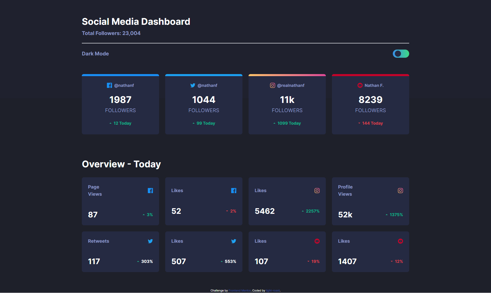

# Frontend Mentor - Social media dashboard with theme switcher solution

This is a solution to the [Social media dashboard with theme switcher challenge on Frontend Mentor](https://www.frontendmentor.io/challenges/social-media-dashboard-with-theme-switcher-6oY8ozp_H). Frontend Mentor challenges help you improve your coding skills by building realistic projects.

## Table of contents

- [Overview](#overview)
   - [The challenge](#the-challenge)
   - [Screenshot](#screenshot)
   - [Links](#links)

- [My process](#my-process)
   - [Built with](#built-with)
   - [What I learned](#what-i-learned)
   - [Useful resources](#useful-resources)

- [Author](#author)
- [Acknowledgments](#acknowledgments)

**Note: Delete this note and update the table of contents based on what sections you keep.**

## Overview

### The challenge

Users should be able to:

- View the optimal layout for the site depending on their device's screen size
- See hover states for all interactive elements on the page
- Toggle color theme to their preference

### Screenshot

### Links

- Solution URL: [Add solution URL here](https://github.com/light-roast/Social-media-dashboard---Tailwind)
- Live Site URL: [Add live site URL here](https://light-roast.github.io/Social-media-dashboard---Tailwind/)

## My process

### Built with

- Semantic HTML5 markup
- Tailwind
- Flexbox
- CSS Grid
- Mobile-first workflow

### What I learned

This is a hands on experience project to practice the knowledge adquired by the course "Curso a fondo de Tailwind" by Código facilito. I learn how o correctly implement a dark-light mode switcher (from the creation of the switch itself to the implementation of this functionality).

### Useful resources

- [Tailwind documentation](https://tailwindcss.com/docs/).
- [Curso a fondo de TailwindCSS by Código facilito](https://codigofacilito.com/cursos/tailwind-css) - The course I use to learn Tailwind and follow up this practice.

## Author

- Website - [Daniel Echeverri](https://daniel-echeverri-portfolio.netlify.app/)
- Frontend Mentor - [light-roast](https://www.frontendmentor.io/profile/light-roast)
